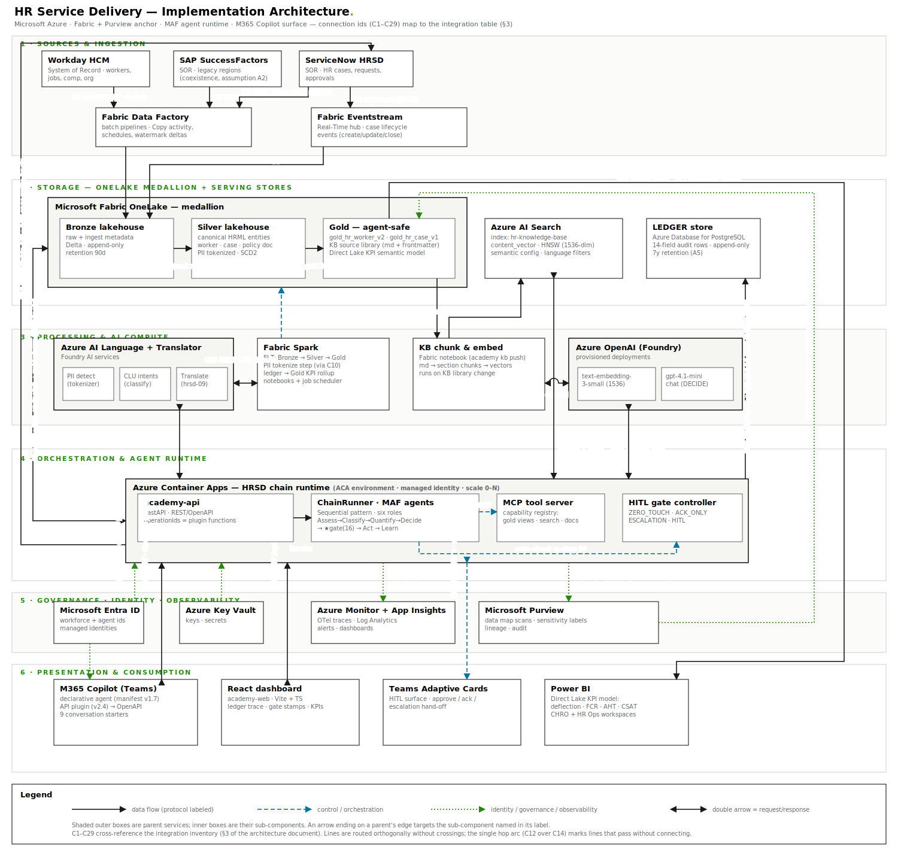

# 09 · HR Service Delivery — Implementation Architecture

**Audience:** enterprise architects and client technical stakeholders.
**Scope:** the production implementation architecture for the nine HR Service Delivery (Tier-0)
scenario chains (hr-hrsd-01 … 09), on Microsoft Azure with **Fabric + Purview as the data and
governance anchor**. This repository is the reference implementation; this document describes
the target-state deployment at a customer site.

**Assumptions (stated once, referenced inline):**

- **A1** — Workday HCM is the primary worker System of Record; ServiceNow HRSD is the case SOR.
- **A2** — SAP SuccessFactors coexists for legacy regions during HCM consolidation; it is a
  read-only upstream here.
- **A3** — One Fabric capacity (F64) hosts OneLake, Data Factory, Eventstream, Spark, and the
  Power BI Direct Lake model. Single workspace per environment (dev/test/prod).
- **A4** — Azure OpenAI is consumed via Foundry provisioned deployments in the same region
  pair as the Fabric capacity (data residency).
- **A5** — The LEDGER is Azure Database for PostgreSQL (flexible server): the audit trail is
  transactional and append-only, and this matches the existing ScenarioChain platform. Fabric
  SQL database is a viable alternative if the client standardizes on Fabric-only.
- **A6** — Chain triggers arrive via the presentation layer (Copilot / dashboard / API).
  Event-initiated chains (e.g., auto-triage on case creation) are a phase-2 extension of the
  Eventstream path and are not drawn.

---

## 1 · Architecture diagram

Six horizontal layers; solid = data flow, dashed = control/orchestration, dotted =
identity/governance/observability. Every connection carries an id (**C1–C29**) that maps to
the integration inventory in §3. Lines are routed orthogonally with no crossings; double
arrows are request/response pairs.

## 2 · Component inventory

| Component | Layer | Role / responsibility | Product / framework | Inputs → Outputs |
|---|---|---|---|---|
| Workday HCM | 1 Ingestion | Worker SOR: jobs, comp, org (A1) | Workday | HR transactions → C1 batch extracts |
| SAP SuccessFactors | 1 Ingestion | Legacy-region worker SOR (A2) | SuccessFactors | HR transactions → C2 OData deltas |
| ServiceNow HRSD | 1 Ingestion | Case SOR: requests, approvals; also the ACT write-back target | ServiceNow HRSD | case lifecycle → C3 events, C4 backfill; ← C19 case writes |
| Fabric Data Factory | 1 Ingestion | Scheduled batch pipelines, watermark deltas | Fabric Data Factory (Copy activity) | C1/C2/C4 → C5 Bronze writes |
| Fabric Eventstream | 1 Ingestion | Real-time case event ingest | Fabric Real-Time hub / Eventstream | C3 webhooks → C6 Delta appends |
| OneLake · Bronze | 2 Storage | Raw landing + ingest metadata, append-only | Fabric lakehouse (Delta) | C5, C6 → C7 |
| OneLake · Silver | 2 Storage | Canonical HRML entities (worker, case, policy doc), PII-tokenized, SCD2 | Fabric lakehouse (Delta) | C7 → C8 |
| OneLake · Gold | 2 Storage | Agent-safe views (`gold_hr_worker_v2`, `gold_hr_case_v1`), KB source library, Direct Lake KPI model | Fabric lakehouse + SQL analytics endpoint + semantic model | C8 → C11, C18, C23 |
| LEDGER store | 2 Storage | 14-field audit row per chain step, append-only (A5) | Azure Database for PostgreSQL | C17 → Spark KPI rollup (via C9 jobs) |
| Azure AI Search | 2 Storage (serving) | Vector + full-text retrieval over the KB (`hr-knowledge-base`, HNSW `content_vector`, semantic config, language filters) | Azure AI Search | C13 → C14 |
| AI Language + Translator | 3 Processing | PII detection (tokenizer), CLU intent classification, translation | Azure AI Language, Azure AI Translator | C10 (Spark), C16 (runtime) |
| Fabric Spark | 3 Processing | ELT Bronze→Silver→Gold, PII tokenize step, ledger→Gold KPI rollup | Fabric Spark notebooks + scheduler | C9 control; C7/C8 data; C10 PII calls |
| KB chunk & embed | 3 Processing | Markdown → section chunks → embedded records; index publisher | Fabric notebook (this repo's `academy kb` pipeline productionized) | C11 in → C12 embed → C13 out |
| Azure OpenAI (Foundry) | 3 Processing | `text-embedding-3-small` (vectors), `gpt-4.1-mini` (DECIDE-stage polish) | Azure OpenAI in Foundry (A4) | C12, C15 |
| academy-api | 4 Orchestration | REST/OpenAPI front door; operationIds are the Copilot plugin functions | FastAPI on Azure Container Apps | C20/C22 in → invokes ChainRunner |
| ChainRunner · MAF agents | 4 Orchestration | Six-role Sequential chain; enforces the single gate at step 16 | Microsoft Agent Framework (Python) | C14/C15/C16/C18 in → C17/C19 out |
| MCP tool server | 4 Orchestration | Governed capability registry the agents call (gold views, search, doc-gen) | MCP (Model Context Protocol) server | C18 (TDS reads) on behalf of agents |
| HITL gate controller | 4 Orchestration | Applies the scenario's gate mode (ZERO_TOUCH / ACK_ONLY / ESCALATION / HITL) | runtime module + Adaptive Cards | C21 approve/ack round-trip |
| Microsoft Entra ID | 5 Governance | Workforce identities, **agent identities**, managed identities | Microsoft Entra ID | C24, C25 |
| Azure Key Vault | 5 Governance | Secrets/keys for runtime (API keys, connection strings) | Azure Key Vault | C26 |
| Azure Monitor + App Insights | 5 Governance | Traces, logs, metrics, alerting | Azure Monitor, Application Insights, Log Analytics | C27 |
| Microsoft Purview | 5 Governance | Data map scans, sensitivity labels, lineage, audit | Microsoft Purview | C28 in, C29 scans |
| M365 Copilot agent | 6 Presentation | The employee surface: declarative agent (v1.7) + API plugin (v2.4) in Teams | M365 Copilot extensibility | user asks ↔ C20 |
| React dashboard | 6 Presentation | Ops/teaching console: ledger trace, gate stamps, KPIs | React + Vite (academy-web) | C22 |
| Teams Adaptive Cards | 6 Presentation | The HITL surface (canonical step 10/16) | Teams + Bot Framework/Graph | C21 |
| Power BI | 6 Presentation | KPI consumption: deflection, FCR, AHT, CSAT (synthetic reference figures) | Power BI Direct Lake | C23 |

## 3 · Integrations and frameworks

Direction is the arrow on the diagram; double arrows are request/response.

| ID | From → To | Type | Mechanism / connector | Sync | Format / schema | Auth |
|----|-----------|------|----------------------|------|-----------------|------|
| C1 | Workday → Data Factory | data | Workday SOAP/REST connector, scheduled full+delta | async (batch, 4×/day) | Workday XML/JSON → staged Parquet | OAuth2 client credentials (ISU account) |
| C2 | SuccessFactors → Data Factory | data | OData v2 connector, watermark deltas | async (batch, daily) | OData entities → Parquet | OAuth2 SAML bearer |
| C3 | ServiceNow → Eventstream | data | ServiceNow Business Rule → webhook to Eventstream custom endpoint | async (event, seconds) | JSON case-lifecycle events | HMAC-signed webhook + Entra app |
| C4 | ServiceNow → Data Factory | data | REST Table API, nightly reconciliation backfill | async (batch) | JSON → Parquet | OAuth2 |
| C5 | Data Factory → Bronze | data | OneLake write (Copy activity sink) | async | Parquet/Delta + ingest metadata columns | Fabric workspace identity |
| C6 | Eventstream → Bronze | data | Eventstream lakehouse sink | async (streaming) | Delta append | Fabric workspace identity |
| C7 | Bronze → Silver | data | Spark structured merge (dedupe, conform, tokenize) | async (scheduled) | Delta MERGE into HRML entities | workspace identity |
| C8 | Silver → Gold | data | Spark gold build: views, KB library sync, semantic model refresh | async (scheduled) | Delta + SQL views + Direct Lake model | workspace identity |
| C9 | Spark ⇢ OneLake | control | Fabric job scheduler orchestrating C7/C8 + KPI rollup | scheduled | n/a (control) | workspace identity |
| C10 | Spark ↔ AI Language | data | REST `:analyze-text` PII entity recognition; values replaced by vault-mapped tokens | sync per batch | JSON in/out | managed identity |
| C11 | Gold → KB pipeline | data | Delta read of the KB source library (md + frontmatter) | async (on change) | markdown + yaml-lite metadata | workspace identity |
| C12 | KB pipeline ↔ AOAI embeddings | data | REST `/embeddings` (`text-embedding-3-small`) | sync per chunk batch | text → float[1536] | managed identity (Foundry RBAC) |
| C13 | KB pipeline → AI Search | data | REST `docs/index` `mergeOrUpload`, batches of 100 | async (pipeline) | chunk record + `content_vector` (schema §4) | managed identity (Search Index Data Contributor) |
| C14 | AI Search ↔ ChainRunner | data | REST `docs/search` hybrid: BM25 + `vectorQueries` (kNN/HNSW), language filter | sync (query time) | query + query-vector → scored chunks | managed identity (query) |
| C15 | AOAI ↔ ChainRunner | data | REST chat completions (DECIDE polish) + query-time embeddings | sync | prompt/draft → completion; text → vector | managed identity |
| C16 | AI Language/Translator ↔ ChainRunner | data | REST: CLU intent, PII detect (intake), translate (hrsd-09) | sync | JSON | managed identity |
| C17 | ChainRunner → LEDGER | data | PostgreSQL wire protocol, INSERT-only role | sync per step | 14-field row (schema §4) | Entra-integrated PG auth, append-only grant |
| C18 | Gold ↔ MCP tools | data | TDS to the Fabric SQL analytics endpoint; scoped, parameterized reads of `gold_hr_worker_v2` / `gold_hr_case_v1` | sync (query time) | SQL result sets (one worker / one worker's cases) | managed identity + row-level security |
| C19 | ChainRunner → ServiceNow | data | REST Table API writes on approved ACT (case create/update) | sync | JSON case payload | OAuth2 (agent identity, least privilege) |
| C20 | M365 Copilot ↔ academy-api | data | REST per the packaged OpenAPI; plugin functions = operationIds (`listScenarios`, `getScenario`, `runScenario`) | sync | JSON (RunOut: answer, gate, KPIs, ledger) | Entra OAuth2 (OAuthPluginVault) — API-key only in test tenants |
| C21 | ChainRunner ⇢ Adaptive Cards | control | Bot Framework / Graph proactive message; card action posts the decision back | async round-trip | Adaptive Card JSON ↔ approve/ack/escalate | Entra bot identity |
| C22 | React dashboard ↔ academy-api | data | REST `/api` (same contract as C20) | sync | JSON | Entra OIDC (SPA) → OBO to API |
| C23 | Gold → Power BI | data | Direct Lake (no import/refresh copy) | live query | KPI semantic model | workspace identity + RLS |
| C24 | Entra → M365 Copilot | governance | OIDC user sign-in; agent identity registration | sync | tokens | Entra |
| C25 | Entra → runtime | governance | OAuth2 on-behalf-of (user context) + managed identity (service context) | sync | JWT | Entra |
| C26 | Key Vault → runtime | governance | ACA secret references at container start | on deploy | secrets | managed identity |
| C27 | runtime → Monitor | governance | OpenTelemetry traces/logs/metrics → App Insights → Log Analytics | async | OTLP | managed identity |
| C28 | runtime → Purview | governance | Atlas REST: lineage for chain runs, audit events for doc-gen (hrsd-06/07) | async | Atlas entities | managed identity |
| C29 | Purview → OneLake | governance | Scheduled data-map scans; classification + sensitivity labels on all three medallion zones | async (scheduled) | classifications/labels | Purview MI (Reader on OneLake) |
| — | api → ChainRunner → MCP → gate (internal) | control | in-process invoke; MCP for tool calls; gate check before ACT | sync | in-proc / MCP | process identity |

**Upstream feed summary:** batch masters via C1/C2/C4 → C5; real-time case telemetry via
C3 → C6. **Downstream consumption summary:** employees via C20 (Copilot) and C21 (gate cards);
operators via C22 (dashboard); executives via C23 (Power BI); the case SOR receives approved
actions back via C19 — the platform never becomes a shadow SOR.

## 4 · Data storage and lifecycle

### Stores

| Store | Type / technology | Purpose | Retention |
|-------|-------------------|---------|-----------|
| Bronze lakehouse | Delta on OneLake | Immutable raw + ingest metadata (source, watermark, batch id) | 90 days |
| Silver lakehouse | Delta on OneLake | Canonical HRML entities, PII-tokenized, SCD2 history | 7 years (HR records; client-policy driven) |
| Gold lakehouse | Delta + SQL analytics endpoint + Direct Lake model | Agent-safe serving views, KB source library, KPI model | current + rebuildable |
| Azure AI Search index | inverted index + HNSW vector graph | Query-time retrieval (hybrid) | rebuildable from Gold via C11–C13 |
| LEDGER | Azure Database for PostgreSQL | Append-only chain evidence | 7 years, INSERT-only role (A5) |

### Canonical schemas

**Silver HRML (excerpt).** `hrml_worker(worker_id, name_token, role, dept, location,
jurisdiction, hire_date, manager_id, salary_band, pto_balance_days, sick_balance_days,
valid_from, valid_to)` · `hrml_case(case_id, worker_id, type, stage, owner, opened, expected,
status, days_in_stage)`. Gold exposes these as `gold_hr_worker_v2` and `gold_hr_case_v1` —
scoped, one-worker-at-a-time views with row-level security; agents never see tables.

**KB chunk record (the AI Search document, built by C11–C13):**
`id, doc_id, title, section, content, doc_type, category, language, jurisdictions[],
scenarios[], tags[], path, content_vector float[1536]` — metadata comes from each document's
frontmatter; `scenarios[]` records which chains a document grounds.

**LEDGER row (exactly 14 fields):** `run_id, seq, timestamp, scenario_id, step (1–24), stage,
agent, persona, action, detail, confidence, hitl_mode, actor, outcome`.

### Movement: raw → curated → serving

Batch (C5) and streaming (C6) land in **Bronze** untouched. Spark (C9 control) conforms and
dedupes into **Silver**, calling AI Language (C10) so PII is tokenized at canonical step 4 —
downstream zones never hold raw identifiers. The gold build (C8) publishes the serving layer:
scoped SQL views for agents (C18), the KB library for the embed pipeline (C11 → C12 → C13
into AI Search), and the Direct Lake KPI model (C23). A scheduled Spark job also rolls ledger
outcomes (written via C17) into the Gold KPI model — that is how gate outcomes become the
deflection/FCR/misroute figures executives see.

### Retrieval and use at query/inference time

A chain run reads three stores, all scoped: the worker/case record via **C18** (TDS,
parameterized, RLS), grounding chunks via **C14** (hybrid text + vector, filtered to the
employee's language and jurisdiction metadata), and the LLM seats via **C15/C16**. Nothing at
inference time reads Bronze or Silver directly — the Gold contract is the only agent surface.

### One record, end to end (Raj asks about PTO carryover)

1. Months earlier, Workday's batch (C1→C5) landed Raj's worker record in Bronze; Spark (C9)
   tokenized his PII (C10) into Silver (C7) and published him to `gold_hr_worker_v2` (C8).
   The PTO policy doc in the Gold KB library was chunked and embedded (C11→C12) and indexed
   with its `content_vector` (C13). Purview's scan labeled all of it (C29).
2. Raj asks the Copilot agent in Teams; the plugin calls `runScenario` (C20) with his Entra
   identity (C24/C25).
3. ASSESS reads exactly one row via the MCP tool (C18). CLASSIFY retrieves the PTO policy
   chunk via hybrid search (C14) — the query is embedded through C15. QUANTIFY applies his
   US-CA rider; DECIDE composes the cited answer and polishes it via C15.
4. The ZERO_TOUCH gate approves (no C21 round-trip needed); every step appended a ledger row
   (C17); lineage/audit events went to Purview (C28) and traces to App Insights (C27).
5. ACT returns the answer through C20 into Teams. No ticket exists — which is the point: the
   nightly rollup moves the deflection KPI in the Direct Lake model, visible to Sofia and the
   CHRO in Power BI (C23). Had this been hr-hrsd-08 below the confidence threshold, the gate
   would have escalated via C21 and the case write-back would have used C19.

## 5 · Cross-cutting concerns

**Security & identity (Entra, C24–C26).** Three identity planes: *users* (OIDC into Copilot,
dashboard SPA; OBO into the API so chains execute under the asking employee — this is what
makes C18's row-level security meaningful); *agents* (registered Entra agent identities with
least-privilege app roles — C19 can write cases but never read comp); *services* (managed
identities everywhere a dotted line touches an Azure service; Key Vault C26 holds only what
can't be identity-based). No secrets in code or manifests; the test-tenant API key mode is
explicitly retired at production cutover (C20 auth column).

**Governance (Purview + gate + ledger, C28/C29, C21, C17).** Purview scans all three medallion
zones (C29): classifications and sensitivity labels ride into the KB chunks' metadata and the
Gold views. The runtime pushes lineage and doc-gen audit events (C28), so a chain run is
traceable from source record to delivered answer. The step-16 gate (C21) is the human control
point; the 14-field LEDGER (C17) is the evidence plane — the same rows serve the auditor and
the KPI rollup. PII exists un-tokenized only in Bronze (90-day retention) and the tokenizer
vault.

**Observability (Monitor, C27).** The runtime emits OpenTelemetry with `run_id` as the
correlation key — one Kusto query joins App Insights traces to LEDGER rows. Alert rules:
gate-escalation rate spike (misroute regression), C14 latency (retrieval SLO), C1/C2 pipeline
freshness (stale worker data poisons every chain), AOAI token consumption per scenario.

**Scalability.** ACA scales the runtime 0→N on HTTP concurrency (each chain run is stateless;
state lives in C17/C18); AI Search scales with replicas (query) and partitions (index size) —
the 132-chunk teaching corpus is nowhere near a partition, and a real client KB of ~50k chunks
fits one S1 partition; AOAI throughput is governed by provisioned deployment capacity (A4)
with the mock/degraded path from this repo retained as the circuit-breaker behavior; Fabric
F64 (A3) covers Spark + Direct Lake with the KPI model refreshless by design. The Eventstream
path (C3/C6) absorbs case-event bursts without touching the runtime (A6).
